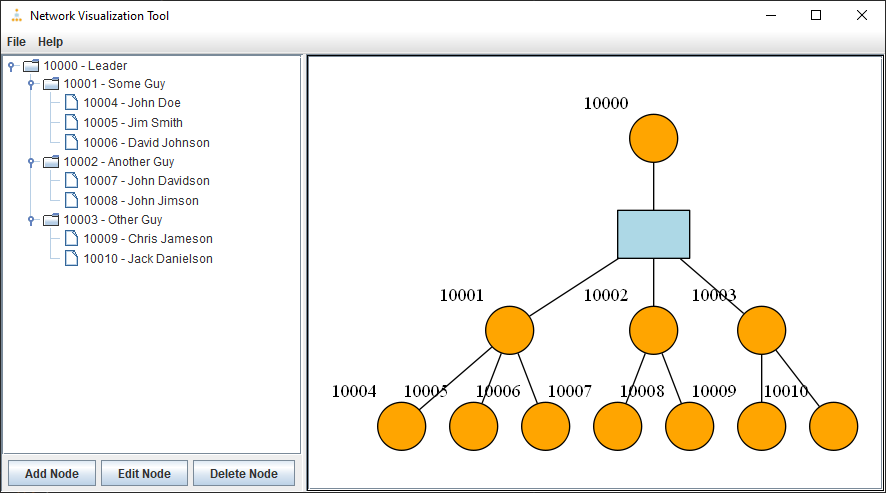
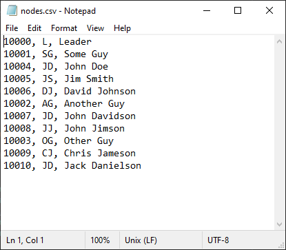
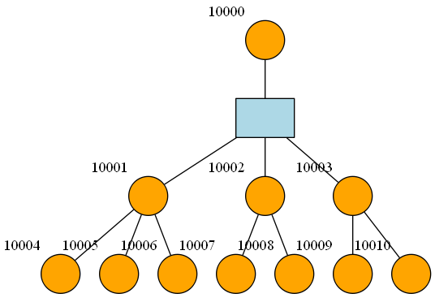

# Network Visualization Tool #
The Network Visualization Tool is used to visualize networks of people. It is written in `Java` and makes uses the `Graphviz` graph visualization application to visualize a network. The network is created using a GUI, where the user can add, remove, or edit nodes. Several options are allowed for using different `Graphviz` layouts as well as image export. A list of the nodes can be exported in .csv format so that it can be referenced with the image output.

#### Saving and Opening Files ####
Files can be saved with a .nv extension. These files can also be opened with the application. There is a file included in the 'other' folder called practice.nv which includes the graph below:

#### Dependencies ####
This application requires [`Graphviz`](https://www.graphviz.org/) to run and it makes use of the [`graphviz-java-api`](https://github.com/jabbalaci/graphviz-java-api) to create the output images for display and export. The [`graphviz-java-api`](https://github.com/jabbalaci/graphviz-java-api) is included in this repository. 

